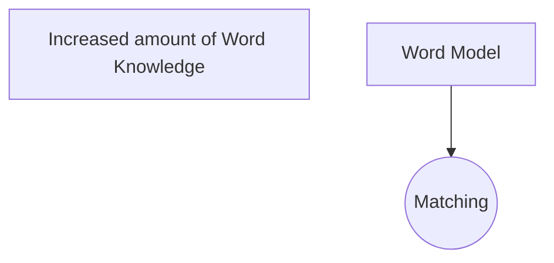

# **CSCI 381 - Computer Vision**

## **Prof. Tsaiyun Phillips**

What is Computer Vision?

## Taxonomy of Computer Vision

<math xmlns="http://www.w3.org/1998/Math/MathML" display="block">
  <mi>x</mi>
  <mo>=</mo>
  <mrow data-mjx-texclass="ORD">
    <mfrac>
      <mrow>
        <mo>&#x2212;</mo>
        <mi>b</mi>
        <mo>&#xB1;</mo>
        <msqrt>
          <msup>
            <mi>b</mi>
            <mn>2</mn>
          </msup>
          <mo>&#x2212;</mo>
          <mn>4</mn>
          <mi>a</mi>
          <mi>c</mi>
        </msqrt>
      </mrow>
      <mrow>
        <mn>2</mn>
        <mi>a</mi>
      </mrow>
    </mfrac>
  </mrow>
  <mo>.</mo>
</math>